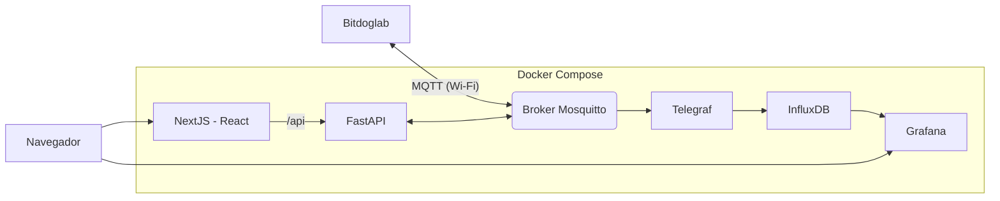

# CultivIa

Monitoramento e controle de estufa com IoT. Uma placa (**BitDogLab** ou
**ESP32**, em MicroPython) envia leituras por Wi-Fi via **MQTT**. No
computador, uma stack **Telegraf + InfluxDB + Grafana** guarda o histórico,
e um site **Next.js** (com uma **API FastAPI** por trás) define a temperatura
e a umidade ideais da placa e mostra o dashboard do Grafana.



## Estrutura

```
CultivIa/
├── firmware/                 código das placas, fizemos uma versão com esp e uma com bitdoglab (ambas MicroPy)
│   ├── bitdoglab/            joystick (sensores simulados) + OLED + alertas; recebe os alvos do site
│   ├── esp32/                simula sensores sem nenhum adc, so o uma função(placa alternativa)
│   └── lib/                  bibliotecas MicroPython (umqtt, ssd1306)
│
├── api/                      FastAPI: ponte HTTP <-> MQTT
│   └── app/
│       ├── main.py           cria o app e liga o MQTT
│       ├── config.py         configura as variáveis e topicos
│       ├── mqtt.py           conecta MQTT + memória da última leitura
│       ├── schemas.py        formato dos JSON (validação)
│       └── routes.py         rotas HTTP
│
├── web/                      Next.js + TypeScript + Tailwind
│   └── src/
│       ├── app/              rotas, cada página é uma pasta
│       │   ├── icon.svg      ícone da aba (mesmo desenho da logo)
│       │   └── (painel)/     rota "/"
│       │       ├── page.tsx
│       │       └── _components/   Logo, ParametrosCard, GrafanaCard
│       ├── components/ui/    peças genéricas: Card, Button, Slider
│       ├── hooks/            lógica reutilizável: useEstado, useComando
│       └── lib/              api.ts, types.ts
│
├── mosquitto/config/         broker: mosquitto.conf + permissões
├── telegraf/                 MQTT -> InfluxDB
├── grafana/                  datasource e dashboard provisionados
├── docker-compose.yml
└── .env.example              modelo das senhas e segredos (copie para .env)
```

## Subir tudo

```bash
cp .env.example .env          # e troque as senhas
docker compose up -d --build
```

| Serviço | Endereço |
|---|---|
| Site | `http://<IP>:8080` |
| Grafana | `http://<IP>:3000` |
| API (docs automáticas) | `http://<IP>:8000/docs` |
| InfluxDB | `http://<IP>:8086` |

Depois grave o firmware na placa: [firmware/README.md](firmware/README.md).

## Como os dados andam

**Leitura (placa → tela).** A placa publica em `cultivia/sensores` a cada 2 s:

```json
{"modo": "joystick", "temperatura_simulada": 25.3, "umidade_simulada": 61.0,
 "temperatura_ideal": 25.0, "umidade_ideal": 50.0,
 "botao_a": 0, "botao_c": 0, "joystick_sw": 0}
```

Dois caminhos consomem essa mensagem:

- **Histórico:** Telegraf → InfluxDB (measurement `estufa`) → Grafana.
- **Tempo real:** a API guarda a última mensagem na memória; o site pergunta
  `GET /api/estado` a cada 2 s.

**Parâmetros (tela → placa).** O site faz `POST /api/setpoint` com
`{"temperatura": 28, "umidade": 60}`; a API valida (0–50 °C, 0–100 %) e publica
em `cultivia/comandos/setpoint` com retain, então uma placa desligada recebe o
valor quando conectar. A placa aplica e confirma em `cultivia/estado`
(mensagem retida; o Last Will publica `{"online":0}` se ela cair). Os alvos
também podem ser mudados nos botões da BitDogLab, e o site acompanha.

## Segurança

- O Mosquitto exige usuário/senha (`esp32`, `api`, `telegraf`, senhas no `.env`)
  e tem ACL por tópico (`mosquitto/config/acl`).
- O site e a API **não têm login**: qualquer um na rede muda os parâmetros.
  Use só em rede local.
- O Grafana com acesso anônimo de leitura é só para rede local.

## Desenvolvimento do site

Precisa de Node.js 20.9 ou mais novo

```bash
cd web
npm install
npm run dev          # http://localhost:3001, /api vai para localhost:8000
npm run typecheck    # confere os tipos TypeScript
```

A API precisa estar rodando 
