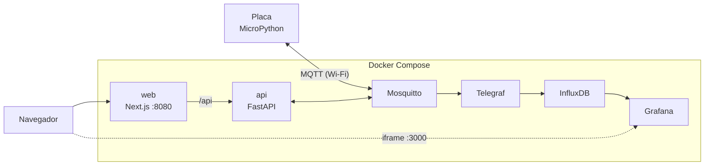

# CultivIa

Monitoramento e controle de estufa com IoT. Uma placa (**BitDogLab** ou
**ESP32**, em MicroPython) envia leituras por Wi-Fi via **MQTT**. No
computador, uma stack **Telegraf + InfluxDB + Grafana** guarda o histórico,
e um site **Next.js** conversa com uma **API FastAPI** para mostrar o estado
e mandar comandos para a placa.



## Estrutura

```
CultivIa/
├── firmware/                 código das placas (ver firmware/README.md)
│   ├── bitdoglab/            joystick + OLED
│   ├── esp32/                simula sensores e obedece comandos do site
│   └── lib/                  bibliotecas MicroPython (umqtt, ssd1306)
│
├── api/                      FastAPI: ponte HTTP <-> MQTT
│   └── app/
│       ├── main.py           cria o app e liga o MQTT
│       ├── config.py         variáveis de ambiente e tópicos
│       ├── mqtt.py           cliente MQTT + memória da última leitura
│       ├── auth.py           confere o token
│       ├── schemas.py        formato dos JSON (validação)
│       └── routes.py         rotas HTTP
│
├── web/                      Next.js + TypeScript + Tailwind
│   └── src/
│       ├── app/              rotas (App Router); cada tela tem sua pasta
│       │   ├── (painel)/     rota "/"  (parênteses não entram na URL)
│       │   │   ├── page.tsx
│       │   │   └── _components/   usados só pelo painel: LeiturasCard...
│       │   └── login/        rota "/login"
│       │       ├── page.tsx
│       │       └── _components/   LoginForm
│       ├── components/       usados por MAIS de uma tela
│       │   └── ui/           peças genéricas: Card, Button, Toggle, Slider...
│       ├── hooks/            lógica reutilizável: useEstado, useComando
│       └── lib/              api.ts, types.ts, token.ts, ...
│
├── mosquitto/config/         broker: mosquitto.conf + acl (permissões)
├── telegraf/                 MQTT -> InfluxDB
├── grafana/                  datasource e dashboard provisionados
├── docker-compose.yml
└── .env.example              modelo dos segredos (copie para .env)
```

## Subir tudo

```bash
cp .env.example .env          # e troque as senhas
docker compose up -d --build
```

| Serviço | Endereço |
|---|---|
| Site | `http://<IP>:8080` (pede o `API_TOKEN` do `.env`) |
| Grafana | `http://<IP>:3000` |
| API (docs automáticas) | `http://<IP>:8000/docs` |
| InfluxDB | `http://<IP>:8086` |

Por SSH: `ssh -L 8080:localhost:8080 -L 3000:localhost:3000 usuario@servidor`.

Depois grave o firmware na placa: [firmware/README.md](firmware/README.md).

## Como os dados andam

**Leitura (placa → tela).** A placa publica em `cultivia/sensores` a cada 2 s:

```json
{"modo": "joystick", "temperatura_simulada": 25.3, "umidade_simulada": 61.0,
 "botao_a": 0, "botao_c": 0, "joystick_sw": 0}
```

Dois caminhos consomem essa mensagem:

- **Histórico:** Telegraf → InfluxDB (measurement `estufa`) → Grafana.
- **Tempo real:** a API guarda a última mensagem na memória; o site pergunta
  `GET /api/estado` a cada 2 s.

**Comando (tela → placa).** O site faz `POST /api/...`, a API valida e publica
em `cultivia/comandos/<ventilador|bomba|luz|setpoint|envio>`. A placa aplica e
confirma em `cultivia/estado` (mensagem retida; o Last Will publica
`{"online":0}` se ela cair).

## Segurança

- O Mosquitto exige usuário/senha (`esp32`, `api`, `telegraf`, senhas no `.env`)
  e tem ACL por tópico (`mosquitto/config/acl`).
- O site exige o `API_TOKEN`; a API confere em toda rota exceto `/health`.
- A bomba desliga sozinha após 60 s no firmware e o comando dela não é retido.
- O Grafana com acesso anônimo de leitura é só para rede local.

## Desenvolvimento do site

Precisa de Node.js 20.9 ou mais novo (`node -v`).

```bash
cd web
npm install
npm run dev          # http://localhost:3001, /api vai para localhost:8000
npm run typecheck    # confere os tipos TypeScript
```

A API precisa estar rodando (`docker compose up -d api`).
