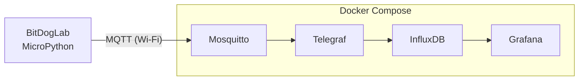

# CultivIa

Monitoramento de estufa com IoT. Uma placa **BitDogLab (RP2350 W)** lê
sensores e envia os dados por Wi-Fi via **MQTT**. No computador, uma stack
**Telegraf + InfluxDB + Grafana** guarda as leituras e as mostra em um
dashboard em tempo real.



## Como funciona

### 1. A placa

O firmware em MicroPython roda na BitDogLab. Por enquanto os sensores são
simulados: o joystick representa a **temperatura** (0–40 °C) e a
**umidade** (0–100 %). Junto com o estado dos botões, esses valores são
publicados em JSON no tópico `cultivia/sensores` a cada 2 segundos:

```json
{"modo": "joystick", "temperatura_simulada": 25.3, "umidade_simulada": 61.0,
 "botao_a": 0, "botao_c": 0, "joystick_sw": 0}
```

O display OLED da placa desenha o histórico da leitura em tempo real.

### 2. O caminho dos dados

| Etapa | Papel |
|---|---|
| **Mosquitto** | Broker MQTT que recebe as mensagens da placa |
| **Telegraf** | Assina o tópico, converte o JSON em métricas e grava no banco |
| **InfluxDB** | Banco de séries temporais que guarda o histórico |
| **Grafana** | Dashboard com valores atuais, gráficos no tempo, modo da placa e botões |

A stack sobe com um único `docker compose up`. O Grafana já vem com a fonte
de dados e o dashboard configurados, sem nenhum passo manual.

## Estrutura

```
firmware/     código MicroPython da BitDogLab
mosquitto/    configuração do broker MQTT
telegraf/     leitura do MQTT e escrita no InfluxDB
grafana/      datasource e dashboard provisionados
docker-compose.yml
```
